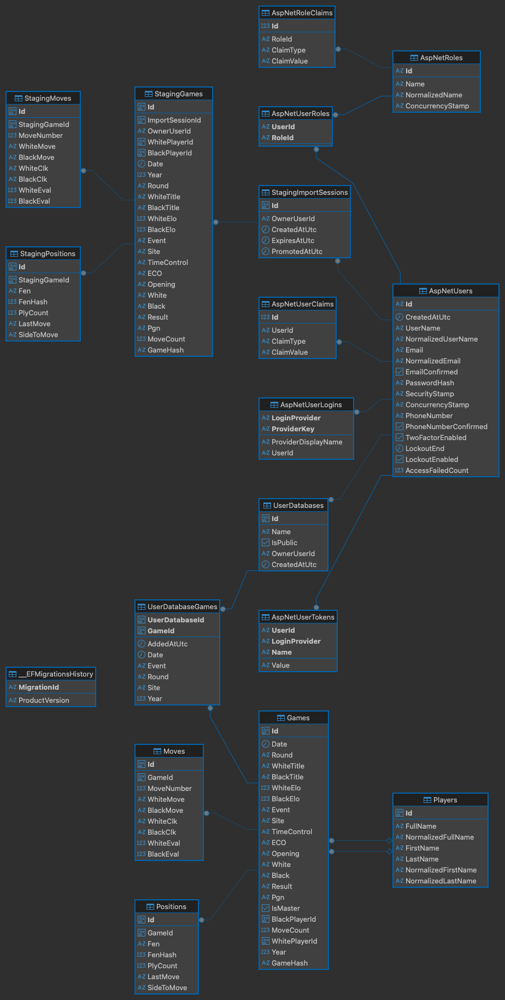

# ChessBase Backend Documentation

## 1. Scope and Intent
This document describes the backend implementation in `backend/` as it exists in source code today. It covers:

- Solution structure and project responsibilities
- Runtime pipeline and dependency injection
- API surface (routes, auth, DTOs, and behavior)
- Application services and business workflows
- Domain model and persistence mapping
- Chess engine/position subsystem
- Import/explorer pipelines
- Security model (Identity + JWT)
- Testing strategy and coverage map
- Operations (run, migrate, test)
- Full source component index

This document intentionally focuses on backend source components and excludes generated `bin/` and `obj/` artifacts.

---

## 2. Backend Topology

### 2.1 Solution and Projects
Primary solution file:

- `backend/ChessBase.sln`

Backend projects:

1. `backend/src/ChessBase.Api`
2. `backend/src/ChessBase.Application`
3. `backend/src/ChessBase.Domain`
4. `backend/src/ChessBase.Infrastructure`
5. `backend/src/ChessBase.Cli`

Test projects:

1. `backend/tests/ChessBase.UnitTests`
2. `backend/tests/ChessBase.IntegrationTests`

### 2.2 Layer Responsibilities

- `ChessBase.Api`: ASP.NET Core host, HTTP controllers, auth endpoints, JWT integration, middleware pipeline.
- `ChessBase.Application`: service layer for PGN import, draft workflows, game explorer orchestration, normalization and hash strategies.
- `ChessBase.Domain`: entities and chess-engine primitives (board state, SAN transition, FEN serializer, Zobrist hashing).
- `ChessBase.Infrastructure`: EF Core DbContext, migrations, repositories, unit-of-work implementation.
- `ChessBase.Cli`: command-line PGN import runner for master import scenarios.

### 2.3 Package/Runtime Baseline
From project files and references:

- .NET target: `net10.0`
- ASP.NET Core Web API
- EF Core + Npgsql provider (PostgreSQL)
- ASP.NET Core Identity (via `IdentityDbContext<ApplicationUser>`)
- JWT Bearer authentication
- xUnit test stack (`xunit`, `Microsoft.NET.Test.Sdk`, `coverlet.collector`)
- Integration test infra: `Microsoft.AspNetCore.Mvc.Testing`, `Testcontainers.PostgreSql`

---

## 3. Runtime Bootstrap and Request Pipeline
Source: `backend/src/ChessBase.Api/Program.cs`

### 3.1 Startup Sequence

1. Create web host builder.
2. Register controllers and problem-details support.
3. Bind JWT options from configuration section `Jwt`.
4. Validate `Jwt:SigningKey` is present; throw if missing.
5. Configure EF Core with PostgreSQL connection string `DefaultConnection`.
6. Configure IdentityCore for `ApplicationUser` with password policy.
7. Configure JWT bearer validation parameters.
8. Register authorization.
9. Register all application/infrastructure/domain services in DI container.
10. Build app.
11. Install global exception handler middleware.
12. Enable authentication and authorization middleware.
13. Map controllers and run.

### 3.2 Service Registration Map (Scoped)

- `IPgnParser -> PgnService`
- `IGameRepository -> GameRepository`
- `IGameExplorerRepository -> GameExplorerRepository`
- `IPlayerRepository -> PlayerRepository`
- `IDraftImportRepository -> DraftImportRepository`
- `IDraftPromotionRepository -> DraftPromotionRepository`
- `IPositionImportCoordinator -> PositionImportCoordinator`
- `IBoardStateSerializer -> FenBoardStateSerializer`
- `IBoardStateFactory -> BoardStateFactory`
- `IBoardStateTransition -> BitboardBoardStateTransition`
- `IPositionHasher -> ZobristPositionHasher`
- `IUnitOfWork -> EfUnitOfWork`
- `IPgnImportService -> PgnImportService`
- `IDraftImportService -> DraftImportService`
- `IDraftPromotionService -> DraftPromotionService`
- `IGameExplorerService -> GameExplorerService`
- `IJwtTokenService -> JwtTokenService`
- `IEmailSender -> LoggingEmailSender`

### 3.3 Middleware Behavior

Global exception middleware:

- Captures unhandled exception (`IExceptionHandlerFeature`)
- Logs with category `GlobalExceptionHandler`
- Returns standardized `ProblemDetails` with HTTP 500:
  - `Title`: `Internal Server Error`
  - `Detail`: generic error message
  - `Instance`: request path

Then standard auth pipeline:

- `UseAuthentication()`
- `UseAuthorization()`
- `MapControllers()`

---

## 4. Security and Identity Model

### 4.1 Identity User
Source: `backend/src/ChessBase.Infrastructure/Data/ApplicationUser.cs`

`ApplicationUser` extends `IdentityUser` and adds:

- `CreatedAtUtc`

### 4.2 Password Policy
Configured in `Program.cs`:

- Minimum length: 8
- Require digit: true
- Require uppercase: true
- Require lowercase: true
- Require non-alphanumeric: false
- Require unique email: true

### 4.3 JWT Configuration
Sources:

- `backend/src/ChessBase.Api/Authentication/JwtOptions.cs`
- `backend/src/ChessBase.Api/Authentication/JwtTokenService.cs`

Defaults:

- Issuer: `ChessBase.Api`
- Audience: `ChessBase.Web`
- Expiration: 60 minutes

Token claims added:

- `sub` (`JwtRegisteredClaimNames.Sub`) => user id
- `unique_name` => username
- `email` => email
- `ClaimTypes.NameIdentifier` => user id
- `ClaimTypes.Name` => username

Validation settings:

- Validate issuer, audience, signing key, and lifetime
- Clock skew: 1 minute

### 4.4 Password Reset Behavior
Source: `backend/src/ChessBase.Api/Controllers/AuthController.cs`

- Forgot password endpoint generates Identity reset token.
- Token is Base64Url-encoded before sending.
- Reset endpoint Base64Url-decodes token and calls `ResetPasswordAsync`.
- Email sender implementation currently logs to app logger (`LoggingEmailSender`), not SMTP.

---

## 5. API Contract and Controller Surface

### 5.1 `AuthController`
Source: `backend/src/ChessBase.Api/Controllers/AuthController.cs`
Base route: `api/auth`

Endpoints:

1. `POST /api/auth/register`
2. `POST /api/auth/login`
3. `POST /api/auth/forgot-password`
4. `POST /api/auth/reset-password`

Behavior highlights:

- Input guard clauses with `BadRequest` on missing required fields.
- Register uses `UserManager.CreateAsync`, then returns JWT token.
- Login accepts username or email for lookup.
- Forgot-password returns success message regardless of user existence (no account enumeration).
- Reset-password validates token format and identity errors.

### 5.2 `PgnImportController`
Source: `backend/src/ChessBase.Api/Controllers/PgnImportController.cs`
Base route: `api/pgn`

Endpoints:

1. `POST /api/pgn/import` (public)
2. `POST /api/pgn/drafts/import` (authorized)
3. `POST /api/pgn/drafts/{importSessionId:guid}/promote` (authorized)

Behavior highlights:

- Uses `StringReader` on PGN request payload.
- Draft endpoints resolve current user id from `ClaimTypes.NameIdentifier` or `sub`.
- Promote requires non-empty `UserDatabaseId`.

### 5.3 `GameExplorerController`
Source: `backend/src/ChessBase.Api/Controllers/GameExplorerController.cs`
Base route: `api/games/explorer`

Endpoints:

1. `POST /api/games/explorer/search` (public)
2. `POST /api/games/explorer/move-tree` (authorized)

Behavior highlights:

- Search requires request body only.
- Move-tree validates:
  - `Fen` is required
  - `UserDatabaseId` required when `Source=UserDatabase`
  - `ImportSessionId` required when `Source=StagingSession`

### 5.4 `UserDatabasesController`
Source: `backend/src/ChessBase.Api/Controllers/UserDatabasesController.cs`
Base route: `api/user-databases`

Endpoints:

1. `GET /api/user-databases/mine` (authorized)
2. `GET /api/user-databases/{id}` (public for public dbs, owner for private)
3. `POST /api/user-databases` (authorized)
4. `PUT /api/user-databases/{id}` (authorized owner)
5. `DELETE /api/user-databases/{id}` (authorized owner)
6. `POST /api/user-databases/{id}/games` (authorized owner)
7. `DELETE /api/user-databases/{id}/games/{gameId}` (authorized owner)

Behavior highlights:

- Name uniqueness enforced per owner (`Conflict` on duplicate).
- `AddGames` validates game IDs exist and avoids duplicate links.
- Adds metadata snapshot (`Date`, `Year`, `Event`, `Round`, `Site`) from `Game` into `UserDatabaseGame`.

---

## 6. Application Layer Deep Dive

### 6.1 `PgnImportService`
Source: `backend/src/ChessBase.Application/Services/PgnImportService.cs`

Purpose:

- Parse PGN stream and persist `Game` records in batches.
- Resolve/create normalized `Player` entities.
- Compute game hash and position chain for each game.

Key behavior:

- Validates non-null reader and positive batch size.
- Skips games missing white/black names.
- Sets `IsMaster` via `markAsMaster` argument.
- For each persisted batch:
  - Set `Year` from `Date`
  - Set `MoveCount`
  - Compute `GameHash`
  - Resolve players via normalized full names
  - Populate positions using position coordinator
  - `AddRangeAsync` games and `SaveChangesAsync`
  - Clear change tracker after save

### 6.2 `DraftImportService`
Source: `backend/src/ChessBase.Application/Services/DraftImportService.cs`

Purpose:

- Import PGN into staging scope tied to user and import session.

Key behavior:

- Session TTL: 7 days (`DefaultDraftTtl`).
- Supports continuation import into existing session when `importSessionId` provided.
- Rejects missing owner id, invalid batch size, expired/already promoted sessions.
- Maps parsed `Game` to `StagingGame` with `StagingMove` list.
- Uses transient `Game` conversion to reuse position coordinator.
- Rehydrates computed positions into `StagingPosition` rows.
- Saves batch and clears tracker.

### 6.3 `DraftPromotionService`
Source: `backend/src/ChessBase.Application/Services/DraftPromotionService.cs`

Purpose:

- Promote user staging games into main `Games` and link into a target `UserDatabase`.

Key behavior:

- Promotion batch size constant: 500.
- Validates session exists, not promoted, target database exists and belongs to owner.
- Wraps promotion in unit-of-work transaction.
- For each staging page:
  - Query existing links in target db by `GameHash`
  - If duplicate:
    - `OverrideMetadata`: update existing link metadata
    - otherwise skip
  - If new game:
    - map to main `Game` + `Move` + `Position`
    - resolve players
    - add game and `UserDatabaseGame` link
  - remove promoted staging rows
  - save + clear tracker
- Marks session promoted and commits transaction.
- Rolls back transaction on exception.

### 6.4 `GameExplorerService`
Source: `backend/src/ChessBase.Application/Services/GameExplorerService.cs`

Search behavior:

- Normalizes optional white/black first and last names.
- Fetches candidate player ids by normalized names.
- Early returns empty result when a requested player filter has no matches.
- Normalizes FEN (trim) when position search enabled.
- Exact mode computes hash from parsed board state.
- Subset mode requires provided FEN string.
- Calls repository with resolved IDs, normalized fen, and fen hash.

Move tree behavior:

- Requires owner user id.
- Empty/whitespace FEN returns empty response.
- Clamps `MaxMoves` to 1..100 with default 20.
- Parses FEN, computes hash, delegates to repository.
- Computes per-move percentages (`WhiteWinPct`, `DrawPct`, `BlackWinPct`) rounded to 2 decimals.

### 6.5 `PgnService`
Source: `backend/src/ChessBase.Application/Services/PgnService.cs`

Responsibilities:

- Parse PGN from string or stream (`IAsyncEnumerable<Game>`).
- Split game blocks and parse tags/moves.
- Capture move annotations (`%eval`, `%clk`) from comments.
- Infer trailing result token when needed.

Notable parser details:

- Game separators: 3+ blank lines for static parse; stream parser uses tag/move boundary logic.
- Tag parsing regex: `[Tag "Value"]` format.
- Supports both move number forms (`1.` and `1...`).
- Ignores variation parentheses tokens and result tokens in move parsing.
- Parses `UTCDate` fallback to `Date` and can extract year even when full date unavailable.

### 6.6 Utility Services

`GameHashCalculator` (`backend/src/ChessBase.Application/Services/GameHashCalculator.cs`):

- Builds SHA-256 hash from normalized players + normalized move token stream.
- Castling normalization `0-0 -> O-O`, `0-0-0 -> O-O-O`.
- Removes SAN annotations (`+`, `#`, `?`, `!`) for comparison stability.
- Handles UCI-like token normalization for comparable hash payload.

`PlayerNameNormalizer` (`backend/src/ChessBase.Application/Services/PlayerNameNormalizer.cs`):

- Trims, decomposes unicode, strips diacritics, lowercases.
- Collapses whitespace.
- Minimal transliteration map for `ł`, `đ`, `ð`.
- Parses `Last, First` or `First ... Last` into parts.

`PositionImportCoordinator` (`backend/src/ChessBase.Application/Services/PositionImportCoordinator.cs`):

- Builds initial board state template.
- Replays SAN moves using board transition service.
- Records position snapshots each ply with:
  - `Fen`
  - `FenHash` (`ZobristKey`)
  - `PlyCount`
  - `LastMove`
  - `SideToMove` (`w`/`b`)
- Stops replay for a game when move application fails.

---

## 7. Domain Model and Chess Engine

### 7.1 Core Entity Catalog
Sources: `backend/src/ChessBase.Domain/Entities/*.cs`

Primary entities:

- `Game`
- `Move`
- `Player`
- `Position`
- `UserDatabase`
- `UserDatabaseGame`
- `StagingImportSession`
- `StagingGame`
- `StagingMove`
- `StagingPosition`

Modeling characteristics:

- `Game` holds canonical PGN metadata plus player IDs and hash.
- `Move` and `Position` form detailed move/position timeline.
- `UserDatabaseGame` is a many-to-many link with metadata snapshot fields.
- Staging entities mirror main entities for draft pipeline isolation.

### 7.2 DbContext Mapping and Index Strategy
Source: `backend/src/ChessBase.Infrastructure/Data/ChessBaseDbContext.cs`

Selected constraints/indexes:

- `ApplicationUser.Email` unique index
- `Player.NormalizedFullName` unique index
- `Player.NormalizedFirstName`, `Player.NormalizedLastName` indexes
- `Game` indexes on `(Year, Id)`, `MoveCount`, `GameHash`
- `Position` indexes on `FenHash`, `(GameId, PlyCount)`
- `UserDatabase` unique `(OwnerUserId, Name)`, plus `IsPublic` index
- `UserDatabaseGame` composite PK `(UserDatabaseId, GameId)`
- `StagingImportSession` indexes on `(OwnerUserId, CreatedAtUtc)` and `ExpiresAtUtc`
- `StagingGame` indexes on owner/session/hash and owner/session/white+black names
- `StagingPosition` indexes on `FenHash` and `(StagingGameId, PlyCount)`

Relationship behavior examples:

- `Move -> Game`: cascade delete
- `UserDatabaseGame -> UserDatabase`: cascade delete
- `UserDatabaseGame -> Game`: cascade delete
- `Game -> Player` links use `DeleteBehavior.Restrict`

### 7.3 Engine Subsystem
Sources:

- `backend/src/ChessBase.Domain/Engine/Models/BoardState.cs`
- `backend/src/ChessBase.Domain/Engine/Serialization/FenBoardStateSerializer.cs`
- `backend/src/ChessBase.Domain/Engine/Services/BitboardBoardStateTransition.cs`
- `backend/src/ChessBase.Domain/Engine/Services/ZobristPositionHasher.cs`
- `backend/src/ChessBase.Domain/Engine/Hashing/ZobristTables.cs`

Key mechanics:

- Board represented as 12 bitboards + occupancy bitboards.
- FEN parser enforces six FEN fields and validates rank structure.
- SAN move transition supports:
  - standard moves
  - captures
  - castling
  - promotions
  - en-passant captures
  - legality checks via king safety
- Zobrist hash maintained incrementally on state transitions.
- Hash includes piece-square, side-to-move, castling rights, and en-passant file.

Note on abstractions:

- `IChessEngine` and `IMoveGenerator` interfaces exist in domain abstractions.
- No concrete implementations are currently registered in DI.

---

## 8. Data Pipelines and Workflows

### 8.1 Pipeline A: Direct Import (`/api/pgn/import`)

1. API validates PGN body.
2. `PgnImportService` parses stream.
3. Invalid player-name games are skipped.
4. Batch persist path executes:
   - set year/move count/hash
   - resolve players
   - compute positions
   - add games and save

Output: `PgnImportResult` (`ParsedCount`, `ImportedCount`, `SkippedCount`).

### 8.2 Pipeline B: Draft Import (`/api/pgn/drafts/import`)

1. Requires authenticated user.
2. Create or fetch session (`StagingImportSession`).
3. Parse PGN and map to staging rows.
4. Compute and attach staging positions.
5. Persist staging batch.

Output: `DraftImportResult` including `ImportSessionId` and expiration timestamp.

### 8.3 Pipeline C: Draft Promote (`/api/pgn/drafts/{id}/promote`)

1. Requires authenticated user and target `UserDatabaseId`.
2. Validate session ownership and state.
3. Read staging games in pages.
4. Detect duplicates by `GameHash` in target DB.
5. Apply duplicate handling mode:
   - `KeepExisting`
   - `OverrideMetadata`
6. Insert non-duplicates into main tables and join table.
7. Delete processed staging rows.
8. Mark session as promoted.

Output: `DraftPromotionResult` with promoted/duplicate/overridden/skipped counts.

### 8.4 Pipeline D: Explorer Search (`/api/games/explorer/search`)

1. Normalize player search terms.
2. Resolve player IDs through `PlayerRepository.SearchIdsAsync`.
3. Apply scalar filters (ELO, year, ECO, result, move count).
4. Optional position filter:
   - `Exact`: FEN hash + exact FEN match
   - `Subset`: piece placement match against FEN prefix
5. Apply sorting and pagination.
6. Return `PagedResult<GameExplorerItemDto>`.

### 8.5 Pipeline E: Move Tree (`/api/games/explorer/move-tree`)

1. Requires authenticated user and FEN.
2. Parse FEN + compute hash.
3. Route by source:
   - `UserDatabase`: validate owner access and aggregate moves from main positions
   - `StagingSession`: validate owner access and aggregate from staging positions
4. Aggregate counts by `LastMove` and game result.
5. Service computes percentages.

Output: `MoveTreeResponse`.

---

## 9. Persistence and Migration History

### 9.1 Database Graph (ERD)

Provided schema graph:

Migration files under `backend/src/ChessBase.Infrastructure/Migrations` show schema evolution timeline:

1. `20260302214248_InitialCreate`
2. `20260303125815_AddMovesTableFinal`
3. `20260305204807_AddPositionTable`
4. `20260310115302_AddIsMasterFlag`
5. `20260312101909_AddPlayersYearMoveCountExplorer`
6. `20260312102243_AddPlayerTable`
7. `20260318120841_AddIdentityAndUserDatabases`
8. `20260318185037_AddStagingArea`

Snapshot file:

- `backend/src/ChessBase.Infrastructure/Migrations/ChessBaseDbContextModelSnapshot.cs`

Design-time EF factory:

- `backend/src/ChessBase.Infrastructure/Data/ChessBaseDesignTimeDbContextFactory.cs`

Factory behavior:

- Resolves `src/ChessBase.Api` to load appsettings.
- Reads connection string from `ConnectionStrings:DefaultConnection` or `CHESSBASE_CONNECTION_STRING`.
- Throws explicit error when unresolved.

---

## 10. Configuration and Operations

### 10.1 Config Files

- `backend/src/ChessBase.Api/appsettings.json`
- `backend/src/ChessBase.Api/appsettings.Example.json`
- `docker-compose.yml` (project root)

### 10.2 Docker Database Service
From `docker-compose.yml`:

- Postgres container: `postgres:latest`
- Container name: `chessbase_db_container`
- Env-based credentials:
  - `CHESSBASE_DB_USER`
  - `CHESSBASE_DB_PASSWORD`
  - `CHESSBASE_DB_NAME`
  - `CHESSBASE_DB_PORT` (optional, default 5432)
- Named volume: `postgres_data`

### 10.3 Typical Backend Runbook

1. Start database:
   - `docker-compose up -d`
2. Restore/build:
   - `cd backend`
   - `dotnet build`
3. Apply migrations:
   - `dotnet ef database update --project src/ChessBase.Infrastructure --startup-project src/ChessBase.Api`
4. Run API:
   - `dotnet run --project src/ChessBase.Api/ChessBase.Api.csproj`

### 10.4 CLI Import Runbook
Source: `backend/src/ChessBase.Cli/Program.cs`

Behavior:

- Builds a host and DI similar to import subset of API stack.
- Loads user secrets for connection string.
- Accepts PGN path from:
  - first CLI arg
  - `CHESSBASE_PGN_PATH`
  - fallback `backend/tests/TestData/games_sample.pgn`
- Imports with `markAsMaster: true`.

Run example:

- `dotnet run --project src/ChessBase.Cli/ChessBase.Cli.csproj -- /absolute/path/to/file.pgn`

---

## 11. DTO and Contract Catalog
Source folder: `backend/src/ChessBase.Application/Contracts`

Request models:

- `AuthRegisterRequest`
- `AuthLoginRequest`
- `ForgotPasswordRequest`
- `ResetPasswordRequest`
- `PgnImportRequest`
- `DraftImportRequest`
- `DraftPromotionRequest`
- `GameExplorerSearchRequest`
- `MoveTreeRequest`
- `CreateUserDatabaseRequest`
- `UpdateUserDatabaseRequest`
- `AddGamesToDatabaseRequest`

Response models:

- `AuthTokenResponse`
- `PgnImportResult`
- `DraftImportResult`
- `DraftPromotionResult`
- `PagedResult<T>`
- `GameExplorerItemDto`
- `MoveTreeResponse`
- `MoveTreeMoveDto`
- `UserDatabaseDto`

Enums and option contracts:

- `DuplicateHandlingMode`
- `EloFilterMode`
- `GameExplorerSortBy`
- `MoveTreeSource`
- `PositionSearchMode`
- `SortDirection`

---

## 12. Testing Strategy and Coverage Map

### 12.1 Unit Tests (`backend/tests/ChessBase.UnitTests`)

Test files:

- `AuthControllerTests.cs`
- `BitboardBoardStateTransitionTests.cs`
- `DraftImportServiceMappingTests.cs`
- `DraftPromotionServiceTests.cs`
- `FenBoardStateSerializerTests.cs`
- `GameExplorerServiceTests.cs`
- `GameHashCalculatorTests.cs`
- `JwtTokenServiceTests.cs`
- `PgnImportServiceTests.cs`
- `PgnService.MoveTests.cs`
- `PgnService.TagTests.cs`
- `PgnServiceTestData.cs`
- `PlayerNameNormalizerTests.cs`
- `PositionImportCoordinatorTests.cs`

Coverage intent:

- Controller behavior and auth handling
- PGN parsing and metadata extraction
- Name normalization and hash stability
- Position serialization/hash/transition correctness
- Draft import/promote mapping rules and duplicate strategy
- Explorer search/move-tree orchestration

### 12.2 Integration Tests (`backend/tests/ChessBase.IntegrationTests`)

Test files:

- `PgnImportControllerApiTests.cs`
- `PgnImportPersistenceTests.cs`
- `DraftPromotionIntegrationTests.cs`
- `UserDatabaseIntegrationTests.cs`

Infrastructure files:

- `Infrastructure/PostgresCollection.cs`
- `Infrastructure/PostgresTestFixture.cs`

Coverage intent:

- HTTP controller behavior including global exception output
- End-to-end DB persistence for import and positions
- Draft promotion transaction semantics and rollback behavior
- User ownership consistency and cascade behavior
- Real PostgreSQL container lifecycle and DB reset process

---

## 13. Current Constraints and Decisions

Based on implementation currently present:

1. Email dispatch is intentionally logger-based (`LoggingEmailSender`) for early-stage development and local testing.
2. `IChessEngine` and `IMoveGenerator` abstractions are intentionally present for future engine features and are not required for the current explorer pipeline.
3. Position search exact mode uses hash + exact FEN comparison in repository queries, reducing hash-collision risk in practical query paths.
4. `appsettings.json` is treated as a local machine file in this workflow; production secrets should still remain in secure secret stores and not in tracked config.

---

## 14. Full Backend Source Component Index

The list below captures backend source/config/test files (excluding regular `bin/` and `obj/` folders; Windows-style `bin\Debug` paths may still appear in workspace and should be treated as generated artifacts):

### 14.1 API

- `backend/src/ChessBase.Api/Authentication/IJwtTokenService.cs`
- `backend/src/ChessBase.Api/Authentication/JwtOptions.cs`
- `backend/src/ChessBase.Api/Authentication/JwtTokenService.cs`
- `backend/src/ChessBase.Api/Controllers/AuthController.cs`
- `backend/src/ChessBase.Api/Controllers/GameExplorerController.cs`
- `backend/src/ChessBase.Api/Controllers/PgnImportController.cs`
- `backend/src/ChessBase.Api/Controllers/UserDatabasesController.cs`
- `backend/src/ChessBase.Api/Email/IEmailSender.cs`
- `backend/src/ChessBase.Api/Email/LoggingEmailSender.cs`
- `backend/src/ChessBase.Api/Program.cs`
- `backend/src/ChessBase.Api/Properties/launchSettings.json`
- `backend/src/ChessBase.Api/appsettings.Example.json`
- `backend/src/ChessBase.Api/appsettings.json`
- `backend/src/ChessBase.Api/ChessBase.Api.csproj`

### 14.2 Application

- `backend/src/ChessBase.Application/Abstractions/IDraftImportService.cs`
- `backend/src/ChessBase.Application/Abstractions/IDraftPromotionService.cs`
- `backend/src/ChessBase.Application/Abstractions/IGameExplorerService.cs`
- `backend/src/ChessBase.Application/Abstractions/IPgnImportService.cs`
- `backend/src/ChessBase.Application/Abstractions/IPgnParser.cs`
- `backend/src/ChessBase.Application/Abstractions/IPositionImportCoordinator.cs`
- `backend/src/ChessBase.Application/Abstractions/IUnitOfWork.cs`
- `backend/src/ChessBase.Application/Abstractions/IUnitOfWorkTransaction.cs`
- `backend/src/ChessBase.Application/Abstractions/Repositories/IDraftImportRepository.cs`
- `backend/src/ChessBase.Application/Abstractions/Repositories/IDraftPromotionRepository.cs`
- `backend/src/ChessBase.Application/Abstractions/Repositories/IGameExplorerRepository.cs`
- `backend/src/ChessBase.Application/Abstractions/Repositories/IGameRepository.cs`
- `backend/src/ChessBase.Application/Abstractions/Repositories/IPlayerRepository.cs`
- `backend/src/ChessBase.Application/Contracts/AddGamesToDatabaseRequest.cs`
- `backend/src/ChessBase.Application/Contracts/AuthLoginRequest.cs`
- `backend/src/ChessBase.Application/Contracts/AuthRegisterRequest.cs`
- `backend/src/ChessBase.Application/Contracts/AuthTokenResponse.cs`
- `backend/src/ChessBase.Application/Contracts/CreateUserDatabaseRequest.cs`
- `backend/src/ChessBase.Application/Contracts/DraftImportRequest.cs`
- `backend/src/ChessBase.Application/Contracts/DraftImportResult.cs`
- `backend/src/ChessBase.Application/Contracts/DraftPromotionRequest.cs`
- `backend/src/ChessBase.Application/Contracts/DraftPromotionResult.cs`
- `backend/src/ChessBase.Application/Contracts/DuplicateHandlingMode.cs`
- `backend/src/ChessBase.Application/Contracts/EloFilterMode.cs`
- `backend/src/ChessBase.Application/Contracts/ForgotPasswordRequest.cs`
- `backend/src/ChessBase.Application/Contracts/GameExplorerItemDto.cs`
- `backend/src/ChessBase.Application/Contracts/GameExplorerSearchRequest.cs`
- `backend/src/ChessBase.Application/Contracts/GameExplorerSortBy.cs`
- `backend/src/ChessBase.Application/Contracts/MoveTreeMoveDto.cs`
- `backend/src/ChessBase.Application/Contracts/MoveTreeRequest.cs`
- `backend/src/ChessBase.Application/Contracts/MoveTreeResponse.cs`
- `backend/src/ChessBase.Application/Contracts/MoveTreeSource.cs`
- `backend/src/ChessBase.Application/Contracts/PagedResult.cs`
- `backend/src/ChessBase.Application/Contracts/PgnImportRequest.cs`
- `backend/src/ChessBase.Application/Contracts/PgnImportResult.cs`
- `backend/src/ChessBase.Application/Contracts/PositionSearchMode.cs`
- `backend/src/ChessBase.Application/Contracts/ResetPasswordRequest.cs`
- `backend/src/ChessBase.Application/Contracts/SortDirection.cs`
- `backend/src/ChessBase.Application/Contracts/UpdateUserDatabaseRequest.cs`
- `backend/src/ChessBase.Application/Contracts/UserDatabaseDto.cs`
- `backend/src/ChessBase.Application/Services/DraftImportService.cs`
- `backend/src/ChessBase.Application/Services/DraftPromotionService.cs`
- `backend/src/ChessBase.Application/Services/GameExplorerService.cs`
- `backend/src/ChessBase.Application/Services/GameHashCalculator.cs`
- `backend/src/ChessBase.Application/Services/PgnImportService.cs`
- `backend/src/ChessBase.Application/Services/PgnService.cs`
- `backend/src/ChessBase.Application/Services/PlayerNameNormalizer.cs`
- `backend/src/ChessBase.Application/Services/PositionImportCoordinator.cs`
- `backend/src/ChessBase.Application/ChessBase.Application.csproj`

### 14.3 Domain

- `backend/src/ChessBase.Domain/Engine/Abstractions/IBoardStateFactory.cs`
- `backend/src/ChessBase.Domain/Engine/Abstractions/IBoardStateSerializer.cs`
- `backend/src/ChessBase.Domain/Engine/Abstractions/IBoardStateTransition.cs`
- `backend/src/ChessBase.Domain/Engine/Abstractions/IChessEngine.cs`
- `backend/src/ChessBase.Domain/Engine/Abstractions/IMoveGenerator.cs`
- `backend/src/ChessBase.Domain/Engine/Abstractions/IPositionHasher.cs`
- `backend/src/ChessBase.Domain/Engine/Factories/BoardStateFactory.cs`
- `backend/src/ChessBase.Domain/Engine/Hashing/ZobristTables.cs`
- `backend/src/ChessBase.Domain/Engine/Models/BoardState.cs`
- `backend/src/ChessBase.Domain/Engine/Models/EngineMove.cs`
- `backend/src/ChessBase.Domain/Engine/Serialization/FenBoardStateSerializer.cs`
- `backend/src/ChessBase.Domain/Engine/Services/BitboardBoardStateTransition.cs`
- `backend/src/ChessBase.Domain/Engine/Services/ZobristPositionHasher.cs`
- `backend/src/ChessBase.Domain/Engine/Types/Bitboard.cs`
- `backend/src/ChessBase.Domain/Engine/Types/CastlingRights.cs`
- `backend/src/ChessBase.Domain/Engine/Types/Color.cs`
- `backend/src/ChessBase.Domain/Engine/Types/MoveType.cs`
- `backend/src/ChessBase.Domain/Engine/Types/Piece.cs`
- `backend/src/ChessBase.Domain/Engine/Types/PieceType.cs`
- `backend/src/ChessBase.Domain/Engine/Types/Square.cs`
- `backend/src/ChessBase.Domain/Entities/Game.cs`
- `backend/src/ChessBase.Domain/Entities/Move.cs`
- `backend/src/ChessBase.Domain/Entities/Player.cs`
- `backend/src/ChessBase.Domain/Entities/Position.cs`
- `backend/src/ChessBase.Domain/Entities/StagingGame.cs`
- `backend/src/ChessBase.Domain/Entities/StagingImportSession.cs`
- `backend/src/ChessBase.Domain/Entities/StagingMove.cs`
- `backend/src/ChessBase.Domain/Entities/StagingPosition.cs`
- `backend/src/ChessBase.Domain/Entities/UserDatabase.cs`
- `backend/src/ChessBase.Domain/Entities/UserDatabaseGame.cs`
- `backend/src/ChessBase.Domain/ChessBase.Domain.csproj`

### 14.4 Infrastructure

- `backend/src/ChessBase.Infrastructure/Data/ApplicationUser.cs`
- `backend/src/ChessBase.Infrastructure/Data/ChessBaseDbContext.cs`
- `backend/src/ChessBase.Infrastructure/Data/ChessBaseDesignTimeDbContextFactory.cs`
- `backend/src/ChessBase.Infrastructure/Data/EfUnitOfWork.cs`
- `backend/src/ChessBase.Infrastructure/Data/EfUnitOfWorkTransaction.cs`
- `backend/src/ChessBase.Infrastructure/Repositories/DraftImportRepository.cs`
- `backend/src/ChessBase.Infrastructure/Repositories/DraftPromotionRepository.cs`
- `backend/src/ChessBase.Infrastructure/Repositories/GameExplorerRepository.cs`
- `backend/src/ChessBase.Infrastructure/Repositories/GameRepository.cs`
- `backend/src/ChessBase.Infrastructure/Repositories/PlayerRepository.cs`
- `backend/src/ChessBase.Infrastructure/Migrations/20260302214248_InitialCreate.cs`
- `backend/src/ChessBase.Infrastructure/Migrations/20260303125815_AddMovesTableFinal.cs`
- `backend/src/ChessBase.Infrastructure/Migrations/20260305204807_AddPositionTable.cs`
- `backend/src/ChessBase.Infrastructure/Migrations/20260310115302_AddIsMasterFlag.cs`
- `backend/src/ChessBase.Infrastructure/Migrations/20260312101909_AddPlayersYearMoveCountExplorer.cs`
- `backend/src/ChessBase.Infrastructure/Migrations/20260312102243_AddPlayerTable.cs`
- `backend/src/ChessBase.Infrastructure/Migrations/20260318120841_AddIdentityAndUserDatabases.cs`
- `backend/src/ChessBase.Infrastructure/Migrations/20260318185037_AddStagingArea.cs`
- `backend/src/ChessBase.Infrastructure/Migrations/ChessBaseDbContextModelSnapshot.cs`
- `backend/src/ChessBase.Infrastructure/ChessBase.Infrastructure.csproj`

### 14.5 CLI and Tests

- `backend/src/ChessBase.Cli/Program.cs`
- `backend/src/ChessBase.Cli/ChessBase.Cli.csproj`
- `backend/tests/ChessBase.UnitTests/AuthControllerTests.cs`
- `backend/tests/ChessBase.UnitTests/BitboardBoardStateTransitionTests.cs`
- `backend/tests/ChessBase.UnitTests/DraftImportServiceMappingTests.cs`
- `backend/tests/ChessBase.UnitTests/DraftPromotionServiceTests.cs`
- `backend/tests/ChessBase.UnitTests/FenBoardStateSerializerTests.cs`
- `backend/tests/ChessBase.UnitTests/GameExplorerServiceTests.cs`
- `backend/tests/ChessBase.UnitTests/GameHashCalculatorTests.cs`
- `backend/tests/ChessBase.UnitTests/JwtTokenServiceTests.cs`
- `backend/tests/ChessBase.UnitTests/PgnImportServiceTests.cs`
- `backend/tests/ChessBase.UnitTests/PgnService.MoveTests.cs`
- `backend/tests/ChessBase.UnitTests/PgnService.TagTests.cs`
- `backend/tests/ChessBase.UnitTests/PgnServiceTestData.cs`
- `backend/tests/ChessBase.UnitTests/PlayerNameNormalizerTests.cs`
- `backend/tests/ChessBase.UnitTests/PositionImportCoordinatorTests.cs`
- `backend/tests/ChessBase.UnitTests/ChessBase.UnitTests.csproj`
- `backend/tests/ChessBase.IntegrationTests/PgnImportControllerApiTests.cs`
- `backend/tests/ChessBase.IntegrationTests/PgnImportPersistenceTests.cs`
- `backend/tests/ChessBase.IntegrationTests/DraftPromotionIntegrationTests.cs`
- `backend/tests/ChessBase.IntegrationTests/UserDatabaseIntegrationTests.cs`
- `backend/tests/ChessBase.IntegrationTests/Infrastructure/PostgresCollection.cs`
- `backend/tests/ChessBase.IntegrationTests/Infrastructure/PostgresTestFixture.cs`
- `backend/tests/ChessBase.IntegrationTests/ChessBase.IntegrationTests.csproj`

---

## 15. Maintenance Notes

When updating this backend, keep this document aligned with changes to:

- DI wiring in `Program.cs`
- contract DTOs and controller routes
- migration additions and schema/index updates
- database graph image in `docs/database-schema.png`
- import, promotion, and explorer behavior
- authentication/authorization claims logic
- test suite additions
